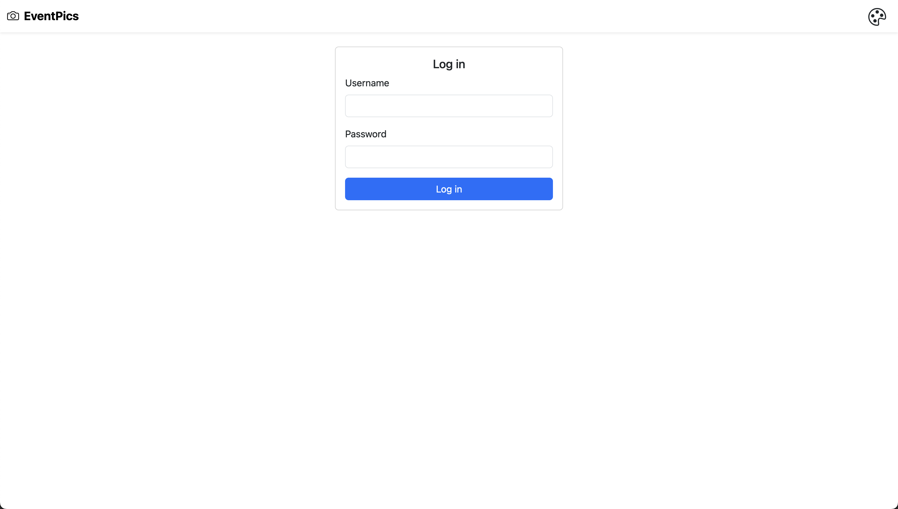
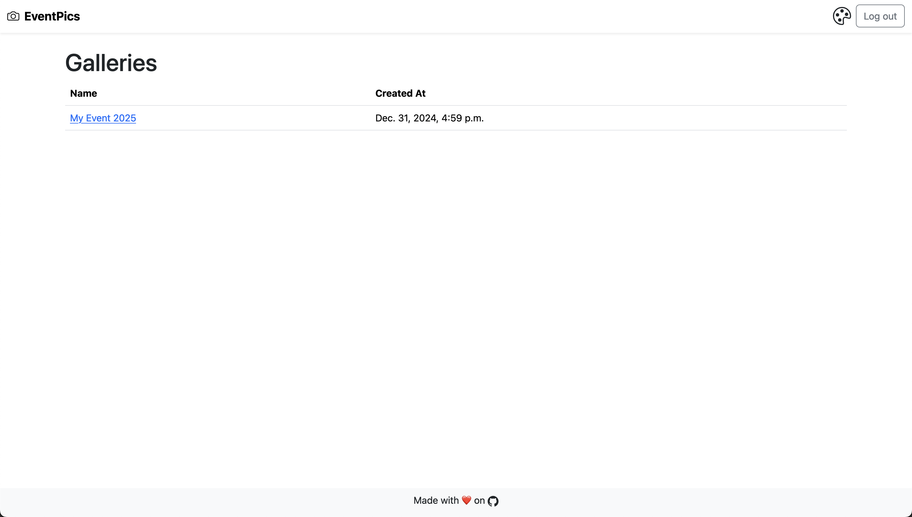
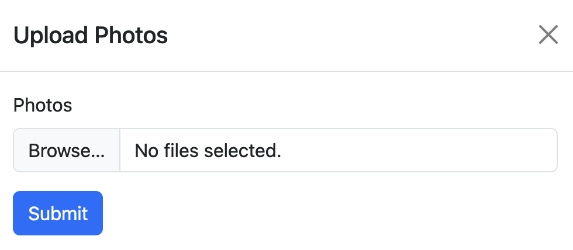

# EventPics

Capture Photos from Events!

EventPics is a simple Django application designed to capture photos from events. Built using [Django](https://www.djangoproject.com/), [Bootstrap 5](https://getbootstrap.com/docs/5.3/getting-started/introduction/), [Bootstrap Icons](https://icons.getbootstrap.com/), and [PostgreSQL](https://www.postgresql.org/). It provides a simple interface for uploading, viewing and downloading photos from events.

## Features

- **User Authentication**: Login and logout functionality.
- **Gallery Management**: Create and manage multiple galleries.
- **Photo Upload**: Upload multiple photos to a gallery.
- **Photo Download**: Download selected photos from a gallery.
- **Access Control**: Restrict access to galleries based on user permissions.
- **Responsive Design**: Mobile-friendly interface using Bootstrap 5.
- **S3 Integration**: Store photos using compatible S3 object storage services.

> [!NOTE]
> Gallery Management and Access Control features are only available at `/admin` to authenticated users with the Django `is_staff` permission.

## Screenshots

### Log in



### Galleries



### Gallery Detail


### Upload Photos



## Deployment

1. Clone the repository:

    ```bash
    git clone https://github.com/dbrennand/EventPics && cd EventPics
    ```

2. Create the `.env` file from the example:

    ```bash
    cp .env.example .env
    ```

3. Populate the `.env` file with your environment variables:

    ```bash
    nano .env
    ```

4. Deploy the application using Docker Compose:

    ```bash
    docker compose up -d --build
    ```

The application listens on port `8000` by default.

## License

[LICENSE](LICENSE)
