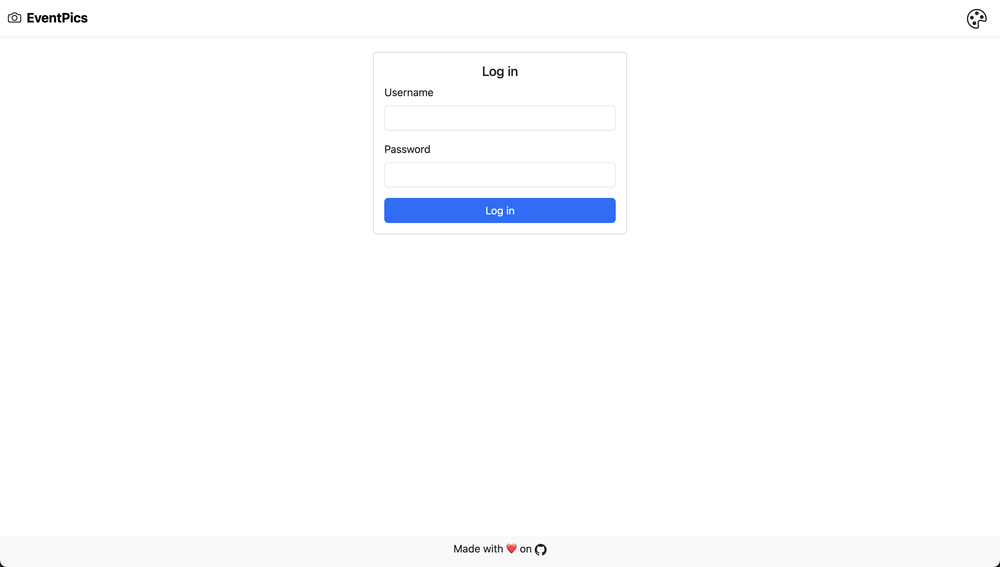

# EventPics 📷


Capture Photos from Events!

EventPics is a simple Django application designed to capture photos from events. Built using [Django](https://www.djangoproject.com/), [Bootstrap 5.3](https://getbootstrap.com/docs/5.3/getting-started/introduction/), [Bootstrap Icons](https://icons.getbootstrap.com/), and [PostgreSQL](https://www.postgresql.org/). It provides a simple interface for uploading, viewing and downloading photos from events.

## Features 🚀

- **User Authentication**: Login and logout functionality.
- **Gallery Management**: Create and manage multiple galleries.
- **Photo Upload**: Upload multiple photos to a gallery.
- **Photo Download**: Download selected photos from a gallery.
- **Access Control**: Restrict access to galleries based on user permissions.
- **Responsive Design**: Mobile-friendly interface using Bootstrap 5.
- **Dark Mode**: Toggle between light and dark modes.
- **S3 Integration**: Store photos using compatible S3 object storage services.

> [!NOTE]
> Gallery Management and Access Control features are only available at `/admin` to authenticated users with the Django `is_staff` permission.

## Screenshots 📸

### Log in



### Galleries


### Gallery Detail

> [!NOTE]
> Sample photos taken from [Pexels](https://www.pexels.com/search/Event/):
> [1](https://www.pexels.com/photo/people-sitting-on-gang-chairs-2774556/)
> [2](https://www.pexels.com/photo/group-of-people-raise-their-hands-on-stadium-976866/)
> [3](https://www.pexels.com/photo/clear-flute-glasses-on-black-tray-16408/)
> [4](https://www.pexels.com/photo/people-having-a-concert-1190297/)


### Upload Photos


## Usage

### S3 Integration 📦

EventPics uses the [`django-storages`](https://django-storages.readthedocs.io/en/latest/) library to store photos in an S3 bucket. For EventPics to function you **must** set the following environment variables in the `.env` file:

```bash
AWS_ACCESS_KEY_ID=
AWS_SECRET_ACCESS_KEY=
AWS_STORAGE_BUCKET_NAME=
AWS_S3_REGION_NAME=
AWS_S3_ENDPOINT_URL=
```

The [`django-storages`](https://django-storages.readthedocs.io/en/latest/backends/s3_compatible/index.html) documentation provides instructions for configuration with S3 compatible object storage services.

### Deployment Steps 🚀

1. Clone the repository:

    ```bash
    git clone https://github.com/dbrennand/EventPics && cd EventPics/docker
    ```

2. Create the `.env` file from the example:

    ```bash
    cp .env.example .env
    ```

3. Populate the `.env` file with your environment variables:

    ```bash
    nano .env
    ```

4. Deploy the application using Docker Compose:

    ```bash
    docker compose up -d --build
    ```

By default the application will be available over HTTPS at [`localhost`](https://localhost). The default configuration is for development purposes and should not be used in production. The provided [`docker-compose.yml`](docker/docker-compose.yml) file uses [Caddy](https://caddyserver.com/) as a reverse proxy.

#### Production Deployment

For production deployments, modify the [`Caddyfile`](docker/conf/Caddyfile) to issue certificates using [Let's Encrypt](https://letsencrypt.org/) via the [HTTP-01](https://caddyserver.com/docs/automatic-https#http-challenge) challenge.

Below is a minimal example Caddyfile configuration:

```
{
    email hello@example.com
}

eventpics.example.com {
    reverse_proxy eventpics:8000
}
```

## License 📝

[LICENSE](LICENSE)
